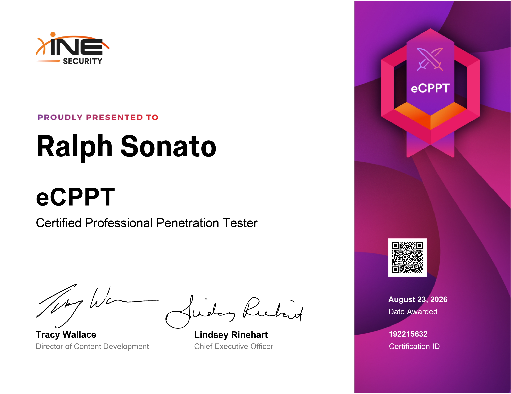

# eCPPTv3 - Certified Professional Penetration Tester

Este repositório serve como diário de bordo da minha jornada para a certificação eCPPTv3 da INE Security.
O foco aqui é documentar todo o meu processo de estudo e preparação e ajudar quem está na mesma jornada.

  

---

## 🏆 Certificado

> **Ralph Sonato - eCPPT Certified Professional Penetration Tester**

  

